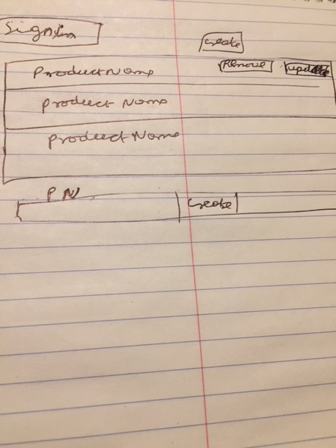

# Pantry List
Below is the url where the application is hosted

[product-client Repo](https://github.com/MaryJosephA/product-client)

[product-client Deployed](https://maryjosepha.github.io/product-client/)

[product-rails-api Repo](https://github.com/MaryJosephA/product-rails-api)

[product-rails-api Deployed](https://enigmatic-plains-70569.herokuapp.com/)

## Procedure
1. Login if you have a credentials if you dont have one or Sign up
2. Click GetList to see all the Pantry List
3. Click AddList to create product and hit save to add new product
4.  Click Update to update the product giving the product id
5. Delete the product by giving product id

## Technologies
HTML, CSS, BOOTSTARP JAVASCRIPT, WEB API RESTFUL SERVICE, RUBY ON RAILS

## project planning
1.  Created wirframe and user story
2. Downloaded the rails-api-template
3. Renamed the app module in config/application.rb to RailsApiTemplate
4. Renamed the pr0ject database in config/database.yml to rails-api-template
5. Initialized the project in the git using git init
6. Added all the filed using git add --all
7. committed all the files using git commit origin master
8. Created a new repository in git hub then ran bundle Install
9. created branches in the git
10.created a .env with keys secret_key_base for development and test
10.Puodocoded the api client like how to link the client and backend
11.created Sign in, Sign Out, changepassword, create,show update and delete form
13.using web api made the form sign in, sign out, change password, create,
   update, show and delete to talk with the api and bring the data to the browser
14.Consume the web api to create show update and delete the resources.
15.  Hosted the site in the Github

## Challenges faced

1.  struggled with connecting the api client and backend but overcame by reading
    documetation.
2.  Had difficulty in displaying the data but managed to
3.  used google chrome to debug the issue

## User Stories

1. User must be able to create a new resource
2. User must be able to update a resource
3. User must be able to delete the resource
4. User must be able to view a single or multiple resources
5. User should get feed back after each action success or failure

## Unsolved problems

1. Will implement the mobile version of the site in next iterartion
2. Enhancement of the site in next iteration which ever is not done
3. Adding animation to the text and site will be done in next iterartion

## WireFrame

## [License](LICENSE)

 For commercial use or
 alternative licensing, please contact mary@gmail.co.
